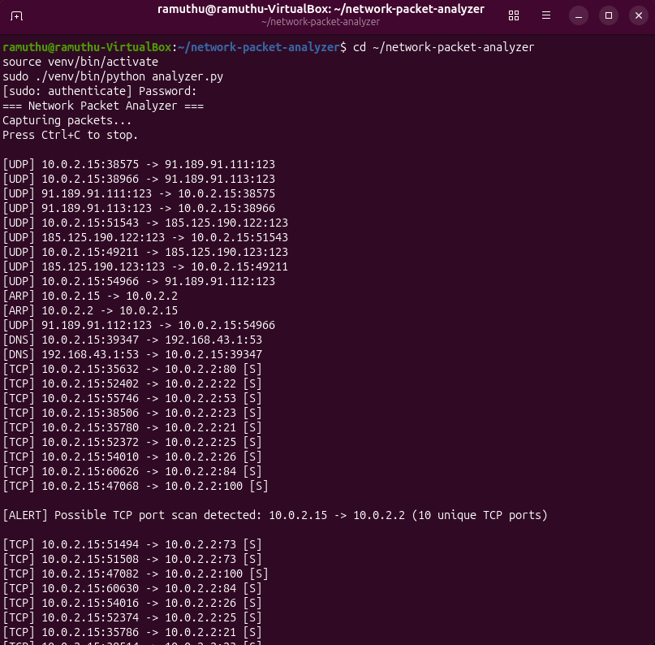
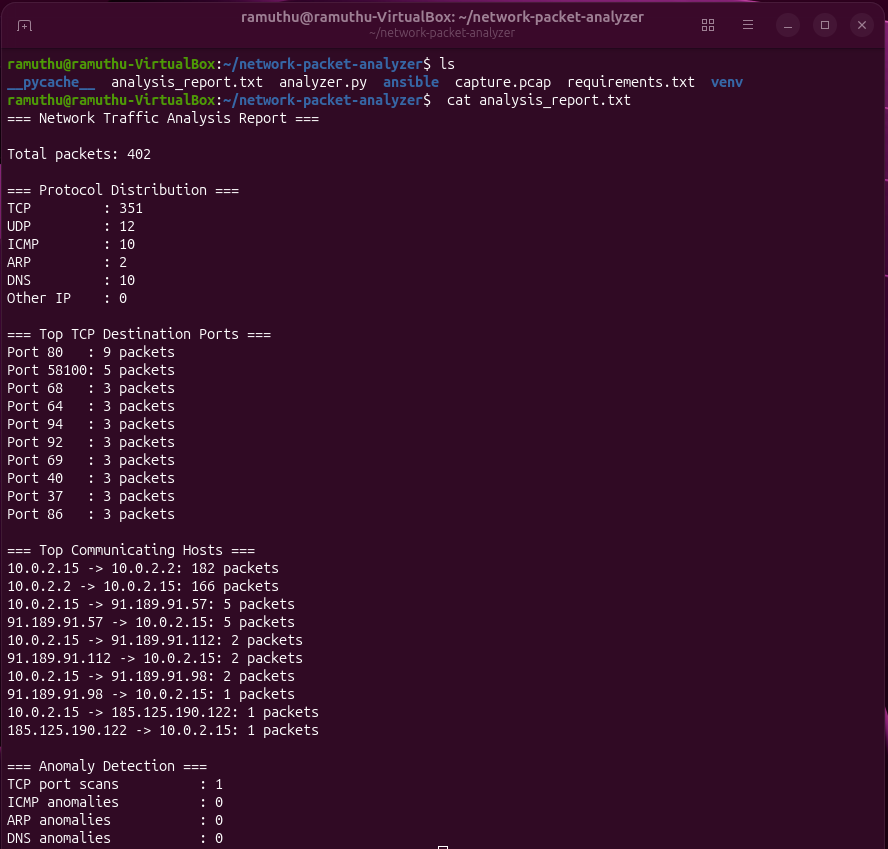
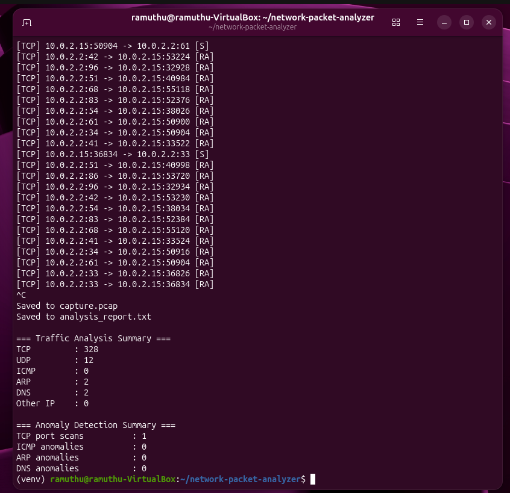
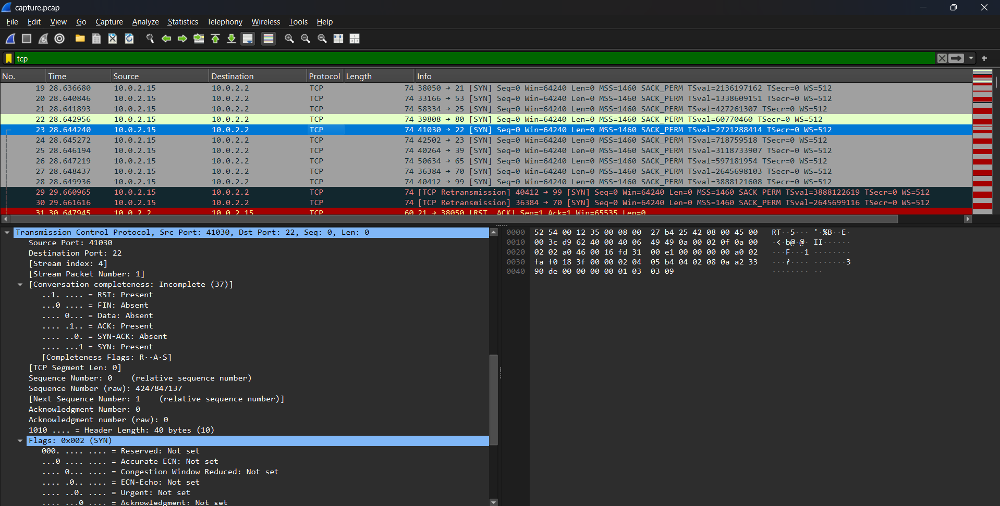
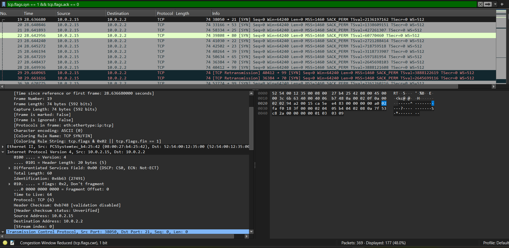
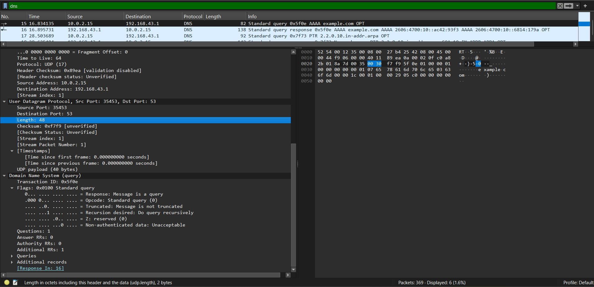

# Automated Network Packet Sniffer & Protocol Analyzer

A Python-based network traffic analysis tool built with **Scapy** for live packet capture, protocol identification, traffic analysis, anomaly detection, and automated reporting.

The project was developed and tested in an Ubuntu virtual machine, with **Wireshark** used for packet-level investigation and **Nmap** used for controlled traffic generation. **Ansible** was used to automate the project environment setup.

---

## Overview

The project implements a practical network traffic analysis workflow:

```text
Live Network Traffic
        │
        ▼
   Packet Capture
        │
        ▼
Traffic & Protocol Analysis
        │
        ▼
  Anomaly Detection
        │
        ├──────────────► capture.pcap
        │
        ▼
 Automated Report
        │
        ▼
Wireshark Investigation
```

### Key Capabilities

* Live packet capture using Scapy
* TCP, UDP, ICMP, ARP, and DNS identification
* Host communication tracking
* TCP destination port analysis
* Rule-based anomaly detection
* PCAP generation
* Automated traffic analysis reporting
* Wireshark-based packet investigation
* Ansible-based environment setup

---

## Detection Capabilities

The analyzer implements four rule-based detection mechanisms:

| Detection             | Approach                                                                   |
| --------------------- | -------------------------------------------------------------------------- |
| **TCP Port Scan**     | Tracks unique TCP destination ports contacted by a source/destination pair |
| **ICMP Anomaly**      | Detects an ICMP traffic spike above a configured threshold                 |
| **ARP Inconsistency** | Detects changes in an observed IP-to-MAC relationship                      |
| **DNS Anomaly**       | Detects unusually high DNS request activity from a source                  |

Detection thresholds are configurable in `analyzer.py`.

---

## Controlled Testing

A controlled TCP port scan was generated using Nmap:

```bash
nmap -sT -Pn -p 20-100 10.0.2.2
```

The analyzer detected the generated scan:

```text
TCP port scans : 1
```

The resulting packets were subsequently investigated in Wireshark to validate the detection at packet level.

---

## Results

A representative capture contained **402 packets**.

| Protocol | Packets |
| -------- | ------: |
| TCP      |     351 |
| UDP      |      12 |
| ICMP     |      10 |
| ARP      |       2 |
| DNS      |      10 |

### Anomaly Detection Results

```text
TCP port scans : 1
ICMP anomalies : 0
ARP anomalies  : 0
DNS anomalies  : 0
```

The detected TCP port scan corresponds to the controlled Nmap test.

DNS is reported separately for analysis purposes while also being included within the UDP traffic count.

---

## Evidence & Investigation

The project includes evidence from both the custom packet analyzer and subsequent Wireshark investigation.

### Packet Analyzer in Action

The analyzer captures live network traffic, identifies protocols, and provides real-time anomaly alerts.



### Automated Analysis Report

After packet capture is stopped, the analyzer generates a structured report containing traffic statistics, communicating hosts, TCP destination ports, and anomaly detection results.



### Final Analysis Summary

The terminal summary provides an overview of the captured traffic and detected anomalies after the capture is completed.



### Wireshark Investigation

The generated `capture.pcap` file was analyzed in Wireshark to investigate and validate the captured traffic.

#### TCP Traffic Analysis



Captured TCP traffic was inspected to verify source and destination addresses, port numbers, packet length, and TCP flags.

#### TCP Port Scan Investigation



TCP SYN packets generated during the controlled Nmap scan were examined to validate the port-scan detection.

The investigation focused on connection attempts with the **SYN flag set and ACK flag not set**.

#### DNS Traffic Analysis



A captured DNS query was inspected to verify the source and destination addresses, UDP ports, and DNS query information.

---

## Automated Reporting

When packet capture is stopped, the analyzer generates:

```text
capture.pcap
analysis_report.txt
```

The analysis report contains:

* Total packet count
* Protocol distribution
* Top TCP destination ports
* Top communicating hosts
* Anomaly detection results

The PCAP file preserves the captured traffic for further investigation in Wireshark.

---

## Ansible Automation

Ansible is used to automate the project environment setup.

The playbook:

1. Creates the Python virtual environment.
2. Installs Scapy in the virtual environment.

Inventory:

```ini
[analyzer]
localhost ansible_connection=local
```

The playbook is designed to be **idempotent**, allowing it to be executed repeatedly without unnecessarily recreating an existing environment.

---

## Development Environment

| Component               | Technology / Environment |
| ----------------------- | ------------------------ |
| Operating System        | Ubuntu                   |
| Programming Language    | Python 3.14.4            |
| Packet Analysis Library | Scapy 2.8.0              |
| Virtualization          | VirtualBox               |
| Network Mode            | NAT                      |
| Packet Investigation    | Wireshark                |
| Traffic Testing         | Nmap                     |
| Automation              | Ansible                  |
| Version Control         | Git / GitHub             |

The generated PCAP was temporarily transferred from the Ubuntu guest to the Windows host using a Python HTTP server and VirtualBox NAT port forwarding before being analyzed in Wireshark.

The temporary HTTP server was used only as a file-transfer mechanism and is not part of the analyzer itself.

---

## Installation

Clone the repository:

```bash
git clone https://github.com/Ramuthu20/network-packet-analyzer.git
cd network-packet-analyzer
```

Create and activate the Python virtual environment:

```bash
python3 -m venv venv
source venv/bin/activate
```

Install the required dependencies:

```bash
pip install -r requirements.txt
```

Run the analyzer with elevated privileges:

```bash
sudo ./venv/bin/python analyzer.py
```

Press `Ctrl+C` to stop packet capture and generate the report.

---

## Project Structure

```text
network-packet-analyzer/
│
├── analyzer.py
├── analysis_report.txt
├── capture.pcap
├── requirements.txt
├── .gitignore
│
├── ansible/
│   ├── hosts.ini
│   └── setup.yml
│
└── Screenshots/
    ├── analyzer-running.png
    ├── analysis-report.png
    ├── final-summary.png
    ├── tcp-analysis.png
    ├── port-scan-analysis.png
    └── dns-analysis.png
```

---

## Technical Skills

### Programming

* Python

### Networking

* Packet Capture
* Network Traffic Analysis
* TCP
* UDP
* ICMP
* ARP
* DNS
* Network Troubleshooting

### Tools & Automation

* Scapy
* Wireshark
* Nmap
* Ansible

### Development

* Linux
* Git & GitHub

---

## Project Scope

This project is intentionally implemented as a lightweight and explainable network analysis tool rather than a full enterprise monitoring or intrusion detection platform.

The current implementation focuses on:

**Capture → Analyze → Detect → Investigate → Report**

Potential future improvements include configurable capture durations, additional detection rules, historical traffic storage, traffic visualization, and remote network monitoring.
